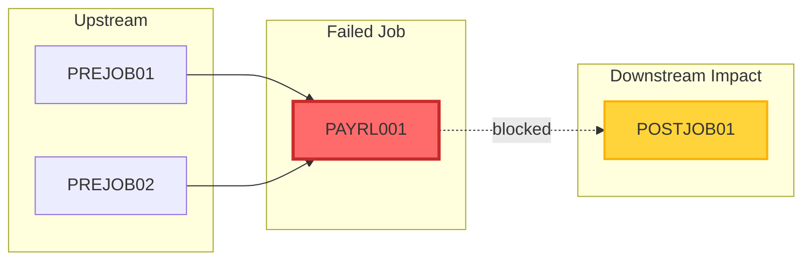
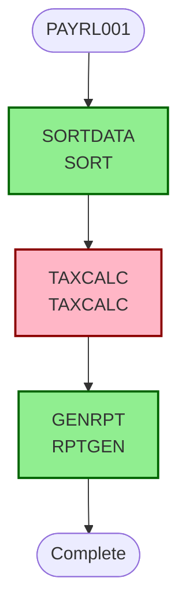

# Root Cause Analysis Report

## Executive Summary

| Field | Value |
|-------|-------|
| **Incident ID** | INC-S0C7-2026-05-15T18-47-35 |
| **Timestamp** | 16/5/2026, 12:17:35 am |
| **ABEND Code** | S0C7 |
| **Offset** | X'B4' |
| **Job** | PAYRL001 |
| **Module** | TAXCALC |
| **Severity** | **CRITICAL** 🔴 |
| **Confidence** | 60% |

---

## 🔴 Root Cause Analysis

**Category:** DATA_EXCEPTION  
**Primary Cause:** Invalid numeric data in PACK operation at X'B4'

### Contributing Factors

1. **MISSING_STEPLIB**
   - Step TAXCALC missing STEPLIB - may have loaded incorrect version of TAXCALC
   - Impact: May have caused incorrect module version to load or invalid data to be processed

2. **KNOWN_RISK_AREA**
   - PACK instruction with external data - risk of S0C7 ABEND if source contains invalid numeric data
   - Impact: Pre-identified forensic risk materialized during execution

## 💥 Impact Assessment

**Operational Severity:** CRITICAL 🔴  
**Critical Path:** Yes ⚠️  
**Downstream Jobs Affected:** 1  

**Impacted Jobs:**
- POSTJOB01

### Dependency Flow

### JCL Job Topology

## 🔬 Forensic Analysis

### Pre-Identified Risk

> **HIGH Severity**: PACK instruction with external data - risk of S0C7 ABEND if source contains invalid numeric data

**Risk Type:** S0C7_RISK  
**Recommendation:** Validate source data before PACK operation or add error handling

### JCL Configuration Issues

- **MISSING_STEPLIB**: Step TAXCALC missing STEPLIB - may have loaded incorrect version of TAXCALC

## ✅ Remediation Plan

### IMMEDIATE Priority

1. **Validate source data before PACK operation or add error handling**
   - Rationale: Addresses the identified forensic risk at the failure point

### HIGH Priority

1. **Add STEPLIB DD statement to TAXCALC pointing to correct program library**
   - Rationale: Ensures correct module version is loaded during execution

### MEDIUM Priority

1. **Implement comprehensive error handling around packed decimal operations**
   - Rationale: Provides graceful degradation instead of ABEND

### LOW Priority

1. **Add logging before critical operations to aid future troubleshooting**
   - Rationale: Improves diagnostic capabilities for similar incidents

---

*Generated by Bee-Keeper Forensic Analysis Engine*  
*Confidence Score: 60% | Severity: CRITICAL*
