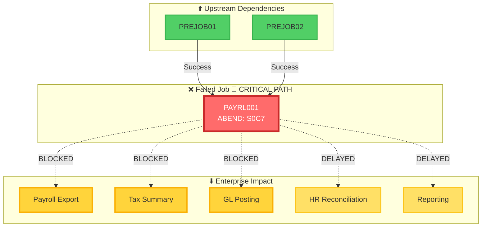
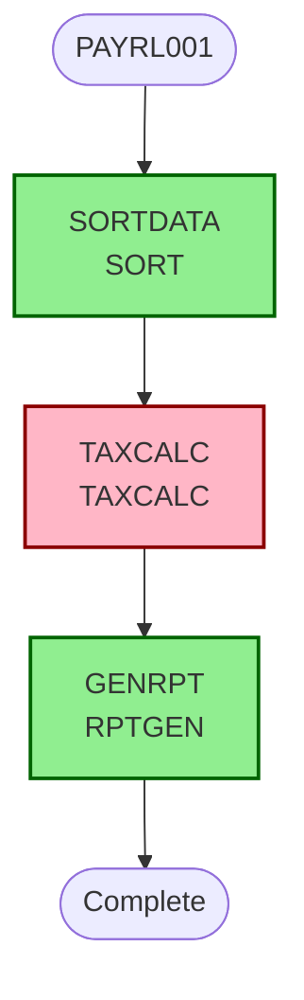

# Root Cause Analysis Report

## Executive Summary

| Field | Value |
|-------|-------|
| **Incident ID** | INC-S0C7-2026-05-15T19-32-42 |
| **Timestamp** | 16/5/2026, 1:02:42 am |
| **ABEND Code** | S0C7 |
| **Offset** | X'B4' |
| **Job** | PAYRL001 |
| **Module** | TAXCALC |
| **Severity** | **CRITICAL** 🔴 |
| **Confidence** | 73% |

### 📚 Operational Knowledge & Trends

#### Similar Incidents (S0C7 Pattern)

**2 similar incident(s)** with same ABEND code:

1. **INC-S0C7-2026-03-12T14-23-45** - TAXCALC at X'A8' - CRITICAL 🔴
2. **INC-S0C7-2026-04-22T08-31-19** - PRICECALC at X'D2' - HIGH 🟠

#### Operational Metrics & Trends

| Metric | Value |
|--------|-------|
| **Total S0C7 Incidents** | 2 |
| **Average Recovery Time** | 0 hours |
| **Average Confidence** | 0% |
| **Incident Frequency** | RECURRING |
| **Improvement Trend** | ➡️ STABLE |
| **First Occurrence** | 12/3/2026 |
| **Last Occurrence** | 22/4/2026 |

> ℹ️ **Stable Pattern**: Consistent recovery performance across incidents.

---

## 🔴 Root Cause

**Invalid numeric data in PACK operation at X'B4'**

*Category: DATA_EXCEPTION*

**Contributing Factors:**
1. Step TAXCALC missing STEPLIB - may have loaded incorrect version of TAXCALC
2. PACK instruction with external data - risk of S0C7 ABEND if source contains invalid numeric data

## 💥 Enterprise Impact

| Metric | Status |
|--------|--------|
| **Severity** | CRITICAL 🔴 |
| **Critical Path** | Yes ⚠️ |
| **Downstream Jobs** | 1 blocked |

### Affected Systems

| System | Status | Business Impact |
|--------|--------|------------------|
| Payroll Export | 🔴 BLOCKED | Payroll processing halted |
| Tax Summary Generation | 🔴 BLOCKED | Compliance reporting delayed |
| GL Posting | 🔴 BLOCKED | Financial close delayed |
| HR Reconciliation | 🟡 DELAYED | HR data integrity issues |
| Downstream Reporting | 🟡 DELAYED | Management visibility impaired |

### Dependency Flow

### JCL Job Topology

## 🔬 Technical Details

**Risk:** PACK instruction with external data - risk of S0C7 ABEND if source contains invalid numeric data - Validate source data before PACK operation or add error handling

**JCL Issues:**
- Step TAXCALC missing STEPLIB - may have loaded incorrect version of TAXCALC

## ✅ Remediation Plan

### IMMEDIATE Priority

1. **Validate source data before PACK operation or add error handling**
   - Rationale: Addresses the identified forensic risk at the failure point

### HIGH Priority

1. **Add STEPLIB DD statement to TAXCALC pointing to correct program library**
   - Rationale: Ensures correct module version is loaded during execution

### MEDIUM Priority

1. **Implement comprehensive error handling around packed decimal operations**
   - Rationale: Provides graceful degradation instead of ABEND

### LOW Priority

1. **Add logging before critical operations to aid future troubleshooting**
   - Rationale: Improves diagnostic capabilities for similar incidents

---

*Generated by Bee-Keeper Forensic Analysis Engine*  
*Confidence Score: 73% | Severity: CRITICAL*
