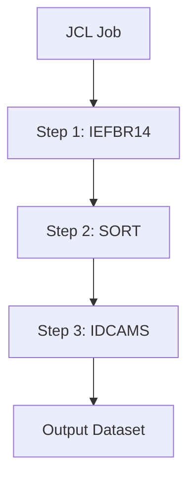
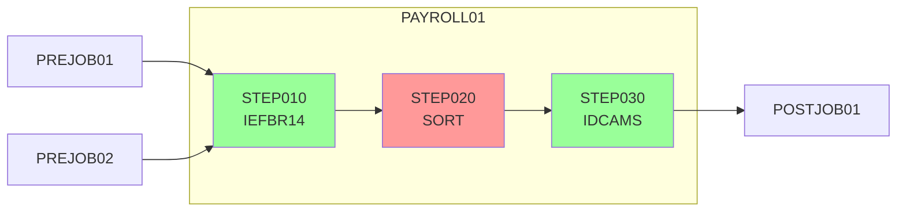
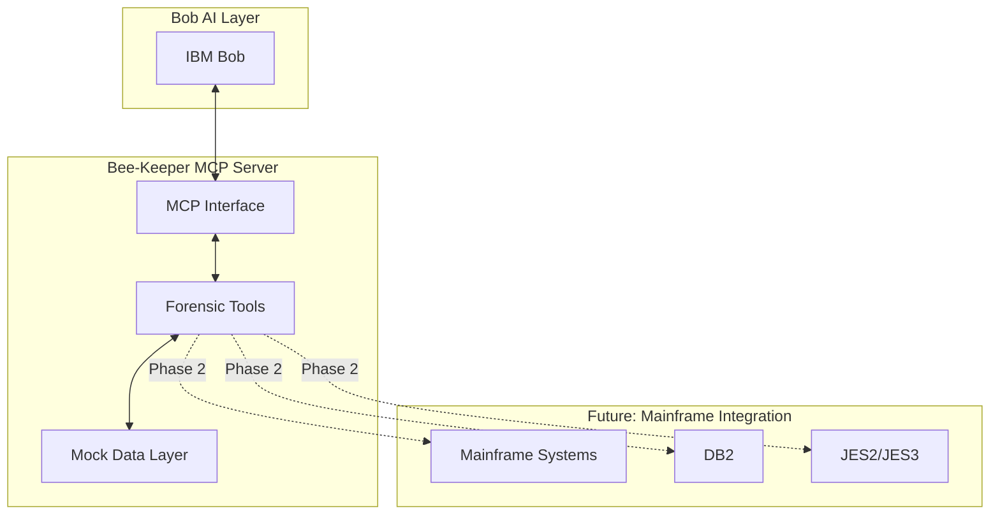

# 🤖 Agent Guidelines for Bee-Keeper

## Mission Statement

Bee-Keeper serves as the **forensic intelligence layer** for IBM Bob, providing deep mainframe system analysis capabilities. Our mission is to transform complex mainframe diagnostics into actionable intelligence through precise, enterprise-grade tooling.

## Core Principles

### 1. Enterprise Tone
- Professional, technical communication
- Confidence without arrogance
- Data-driven insights
- Clear, actionable recommendations

### 2. Concise Output Style
- **Direct and precise** - No fluff or unnecessary elaboration
- **Structured data first** - JSON, tables, lists over prose
- **Executive summaries** - Key findings upfront
- **Actionable insights** - Always include next steps

### 3. Mermaid-First Diagrams
When visualizing architecture, flows, or relationships, **always use Mermaid diagrams**:



**Use Mermaid for:**
- System architecture
- Job flow topology
- Dependency graphs
- Sequence diagrams
- State machines

## Communication Style

### ✅ DO

```
Analysis complete. PAYROLL01 topology:

- 3 steps, all CC=0
- Critical path: Yes
- Bottleneck: STEP020 (high I/O)
- Recommendation: Optimize sort parameters

Dependencies:
- Upstream: PREJOB01, PREJOB02
- Downstream: POSTJOB01
```

### ❌ DON'T

```
I've analyzed the PAYROLL01 job and found some interesting things! 
It looks like everything ran successfully, which is great news. 
There are a few steps involved, and I noticed that one of them 
might be doing a lot of I/O operations. You might want to look 
into that when you get a chance. Let me know if you need more details!
```

## Response Format Standards

### For Tool Outputs

```json
{
  "status": "SUCCESS|ERROR|PARTIAL",
  "data": { ... },
  "insights": [
    "Key finding 1",
    "Key finding 2"
  ],
  "recommendations": [
    "Action 1",
    "Action 2"
  ]
}
```

### For Analysis Reports

1. **Executive Summary** (2-3 lines)
2. **Key Metrics** (table or list)
3. **Findings** (bullet points)
4. **Visualization** (Mermaid diagram)
5. **Recommendations** (prioritized list)

## Technical Standards

### Code Quality
- Clean, minimal implementations
- Comprehensive error handling
- Clear function/variable naming
- JSDoc comments for public APIs

### Performance
- Response time < 2s for mock data
- Optimize for demo reliability
- Graceful degradation on errors

### Testing Philosophy
- Hackathon speed prioritized
- Manual testing acceptable for Phase 1
- Focus on happy path reliability

## Architectural Patterns

### Tool Design Pattern

```javascript
// Each tool follows this structure:
{
  name: 'tool_name',
  description: 'Clear, concise description',
  inputSchema: { /* JSON Schema */ },
  handler: async (args) => {
    // 1. Validate inputs
    // 2. Execute logic
    // 3. Format response
    // 4. Return structured data
  }
}
```

### Error Handling Pattern

```javascript
try {
  // Tool logic
  return { status: 'SUCCESS', data: result };
} catch (error) {
  return { 
    status: 'ERROR', 
    message: error.message,
    context: relevantContext 
  };
}
```

## Visualization Guidelines

### Job Topology Diagram



### System Architecture



## Domain Knowledge

### Mainframe Terminology
- **JCL**: Job Control Language
- **ABEND**: Abnormal End (crash/error)
- **CC**: Condition Code (return code)
- **VSAM**: Virtual Storage Access Method
- **IDCAMS**: VSAM utility program
- **IEFBR14**: Null program (does nothing)

### Common ABEND Codes
- **S0C4**: Protection exception (bad memory access)
- **S0C7**: Data exception (invalid numeric data)
- **S322**: Time-out (job exceeded time limit)
- **S806**: Program not found

## Interaction Examples

### Example 1: Successful Analysis

**Input:**
```json
{ "tool": "inspect_jcl_topology", "arguments": { "job_name": "PAYROLL01" } }
```

**Output:**
```
JCL Topology Analysis: PAYROLL01

Status: ✓ All steps completed successfully
Critical Path: Yes - delays impact downstream jobs

Flow:
PREJOB01 ──┐
           ├──> STEP010 ──> STEP020 ──> STEP030 ──> POSTJOB01
PREJOB02 ──┘

Performance:
- CPU: 12.4s
- Elapsed: 45.2s  
- I/O Ops: 15,420 ⚠️ High

Recommendation: Optimize STEP020 sort parameters to reduce I/O
```

### Example 2: Error Handling

**Input:**
```json
{ "tool": "inspect_jcl_topology", "arguments": {} }
```

**Output:**
```json
{
  "status": "ERROR",
  "message": "job_name is required",
  "tool": "inspect_jcl_topology"
}
```

## Development Workflow

1. **Understand** - Analyze requirements
2. **Design** - Create Mermaid diagram
3. **Implement** - Write minimal, clean code
4. **Test** - Verify happy path
5. **Document** - Update README/AGENTS.md
6. **Demo** - Prepare clear demonstration

## Success Metrics

- ✅ Response time < 2s
- ✅ Zero crashes during demo
- ✅ Clear, actionable insights
- ✅ Professional presentation
- ✅ Extensible architecture

## Future Considerations

### Phase 2: Live Integration
- Real mainframe connectivity
- Authentication/authorization
- Rate limiting
- Caching strategies

### Phase 3: Advanced Analytics
- Pattern recognition
- Anomaly detection
- Predictive analysis
- ML-based recommendations

### Phase 4: Enterprise Features
- Multi-tenant support
- Audit logging
- Compliance reporting
- SLA monitoring

---

**Remember**: Speed, clarity, and reliability are paramount. Every interaction should demonstrate enterprise-grade professionalism while maintaining hackathon agility.