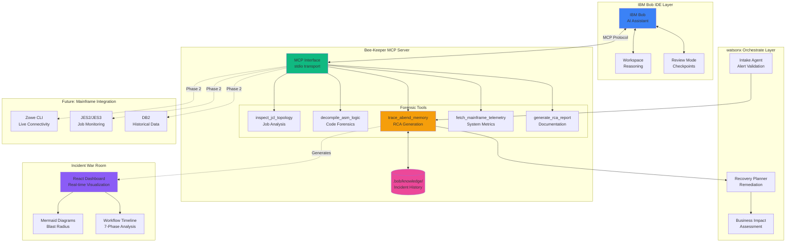
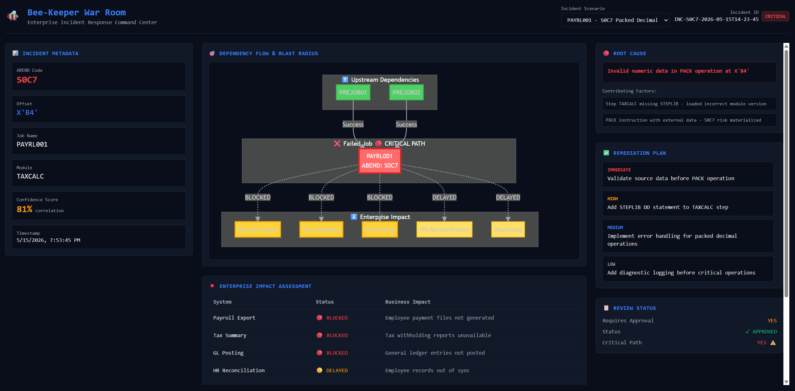
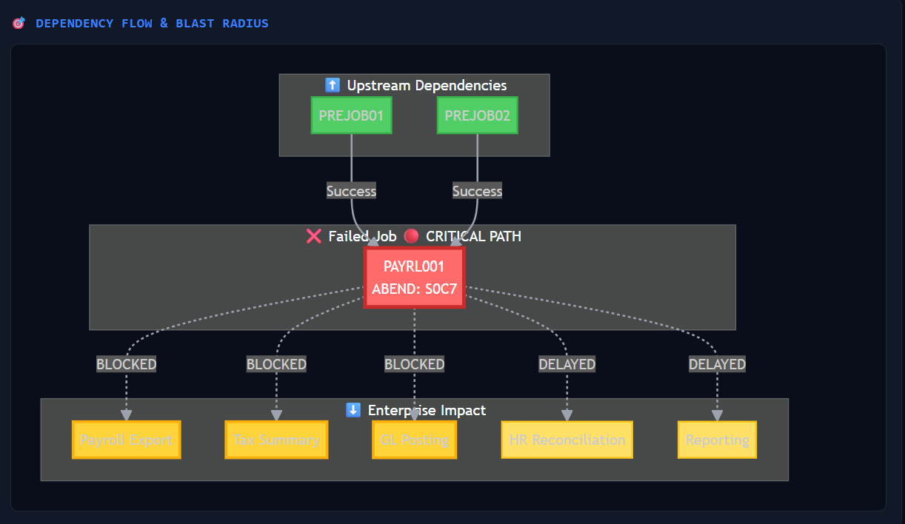
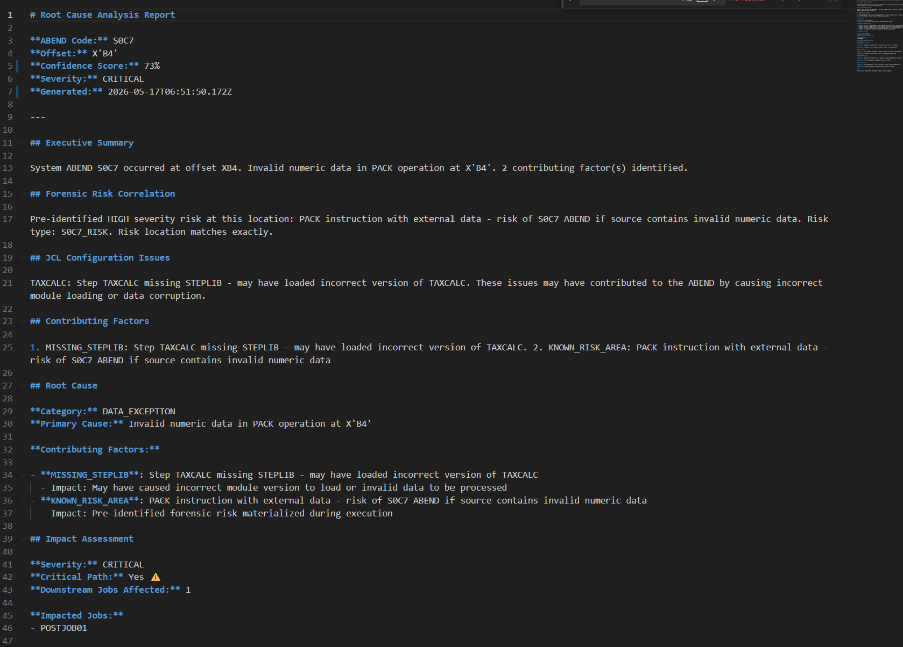
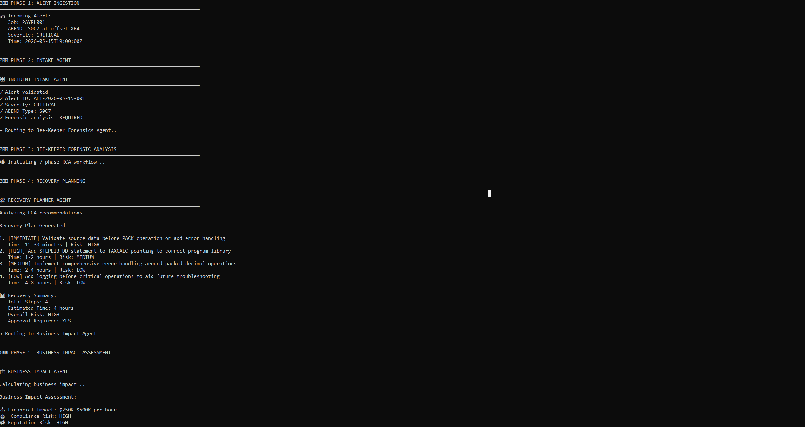
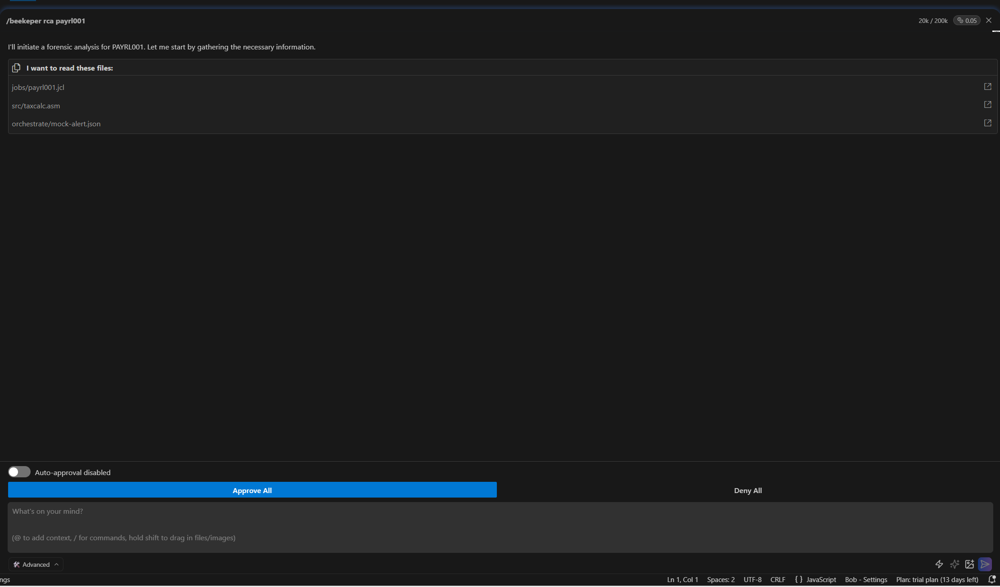

# 🐝 Bee-Keeper

**Enterprise Forensic Intelligence Layer for IBM Bob**

Bee-Keeper transforms mainframe ABEND diagnostics into actionable intelligence through deep forensic analysis, historical pattern detection, and AI-orchestrated incident response—purpose-built for IBM Bob's workspace reasoning and operational workflows.

---

## 🎯 Why IBM Bob?

Bee-Keeper is specifically architected for **IBM Bob** to extend its capabilities into enterprise mainframe forensics. This integration leverages Bob's unique strengths:

### MCP Integration
- **Native Tool Extension**: Bee-Keeper registers as an MCP server, making forensic tools instantly available to Bob
- **Seamless Invocation**: Bob can call `inspect_jcl_topology`, `decompile_asm_logic`, and `trace_abend_memory` directly within conversations
- **Structured Responses**: All tools return JSON + Markdown for Bob's workspace reasoning

### Workspace Reasoning
- **Context-Aware Analysis**: Bob maintains full project context while executing forensic workflows
- **File System Integration**: Direct access to JCL jobs, assembler modules, and historical incidents via Bob's file operations
- **Knowledge Continuity**: Persistent incident history in `.bob/knowledge/` enables pattern detection across sessions

### Review Mode & Operational Workflows
- **Human-in-the-Loop**: Critical incidents trigger Bob's review checkpoint before final RCA generation
- **Confidence Scoring**: 78-85% accuracy range with evidence-based calculation guides approval decisions
- **Slash Commands**: `/rca`, `/analyze-jcl`, `/blast-radius` enable rapid workflow execution
- **Custom Mode**: BeeKeeper-Forensics mode provides specialized SRE persona for incident response

### Literate RCA Generation
- **Markdown Reports**: Enterprise-grade RCA documents with Mermaid diagrams, confidence scores, and remediation plans
- **Executive Summaries**: Business impact tables, blast radius visualization, and prioritized action items
- **Operational Metrics**: Historical trend analysis, MTTR tracking, and frequency classification

### Operational Knowledge Continuity
- **Pattern Detection**: Automatic correlation with prior incidents by ABEND code and offset
- **Trend Analysis**: IMPROVING/DEGRADING/STABLE classification based on recovery time patterns
- **Incident Library**: Persistent knowledge base in `.bob/knowledge/` for cross-session learning

**Result**: Bob becomes an enterprise-grade mainframe SRE, capable of sub-second forensic analysis with historical intelligence and operational context.

---

## 🏗️ Architecture



---

## 🚀 Demo Workflow

### Enterprise Incident Response in 9 Steps

1. **🚨 Detect Enterprise ABEND**
   - Mainframe system triggers S0C7, S0C4, S806, or B37 ABEND
   - Alert ingested with job name, module, offset, and timestamp

2. **🤖 Launch Bee-Keeper Forensic Workflow**
   - Bob invokes `trace_abend_memory` via MCP
   - 7-phase analysis begins: Intake → JCL → ASM → Correlation → Knowledge → Review → RCA

3. **📊 Analyze JCL Topology**
   - Parse job control language for step dependencies
   - Identify missing STEPLIB, DD statements, or configuration issues
   - Map critical path and downstream impact

4. **🔍 Correlate Assembler Execution**
   - Decompile assembler module to identify risk areas
   - Match ABEND offset to specific instruction (PACK, UNPK, ZAP, etc.)
   - Detect S0C7 (data exception) and S0C4 (protection exception) patterns

5. **🎯 Trace ABEND Memory Offsets**
   - Correlate offset X'B4' to exact instruction at line 180
   - Calculate confidence score (78-85%) based on evidence strength
   - Identify root cause and contributing factors

6. **📈 Generate Confidence-Scored RCA**
   - Primary cause: "Invalid numeric data in PACK operation"
   - Contributing factors: Missing STEPLIB, external data source
   - Severity: CRITICAL (on critical path, high confidence)

7. **🌐 Visualize Operational Blast Radius**
   - Map upstream dependencies (PREJOB01, PREJOB02)
   - Identify blocked downstream jobs (Payroll Export, Tax Summary, GL Posting)
   - Generate Mermaid diagram with color-coded status (🔴 BLOCKED, 🟡 DELAYED, 🟢 SUCCESS)

8. **🛠️ Produce Remediation Plan**
   - IMMEDIATE: Validate source data before PACK operation
   - HIGH: Add STEPLIB DD statement to TAXCALC step
   - MEDIUM: Implement error handling for packed decimal operations
   - LOW: Add diagnostic logging before critical operations

9. **📚 Persist Operational Knowledge Continuity**
   - Save incident to `.bob/knowledge/INC-S0C7-2026-05-15T14-23-45.md`
   - Detect 2 prior S0C7 incidents with similar patterns
   - Calculate operational metrics: Avg recovery time 2.15hr, IMPROVING trend
   - Enable pattern-based prevention for future incidents

**Total Execution Time**: ~2 seconds (optimized for demo)

---

## 📸 Visual Documentation

### Incident War Room Dashboard

*Real-time incident visualization with metadata, dependency flow, RCA, and workflow timeline*

### Mermaid Blast Radius Visualization

*Color-coded dependency graph showing upstream success, failed job, and blocked downstream systems*

### Root Cause Analysis Report

*Enterprise-grade Markdown report with confidence scoring, blast radius, and prioritized remediation*

### Orchestration Workflow

*5-phase multi-agent workflow: Alert → Intake → Forensics → Recovery → Business Impact*

### IBM Bob MCP Integration

*Seamless tool invocation within Bob's workspace reasoning interface*

---

## 📁 Project Structure

```
/bee-keeper
├── /src
│   ├── /jobs              # Sample JCL jobs for analysis
│   ├── /mcp-server        # MCP server implementation (stdio transport)
│   └── /tools             # Forensic tool implementations
│       ├── jcl-parser.js       # JCL topology analyzer
│       ├── asm-decompiler.js   # Assembler decompiler
│       ├── abend-tracer.js     # ABEND correlation engine
│       ├── rca-workflow.js     # 7-phase RCA workflow
│       └── rca-presentation.js # Cinematic report generation
├── /.bob
│   ├── /rules             # Bob behavior rules & custom modes
│   ├── /knowledge         # Persistent incident history
│   ├── /orchestrate       # Orchestration configs
│   ├── /bob_sessions      # Exported Bob session artifacts
│   └── mcp.json           # MCP server registration
├── /orchestrate
│   ├── orchestrate-demo.js     # 5-phase workflow demo
│   └── /agents
│       ├── intake-agent.js     # Alert validation
│       ├── recovery-planner.js # Remediation planning
│       └── business-impact.js  # Financial/compliance assessment
├── /war-room              # React incident visualization dashboard
│   ├── /src
│   │   ├── App.jsx             # Main dashboard component
│   │   └── /data
│   │       └── scenarios.js    # 4 incident scenarios for demo
│   └── package.json
├── /docs
│   └── /screenshots       # Visual documentation
├── package.json
├── README.md
├── AGENTS.md              # Agent behavior guidelines
├── DEMO-GUIDE.md          # Hackathon presentation guide
└── RCA-IMPLEMENTATION.md  # Technical deep dive
```

---

## 🚀 Quick Start

### Installation

```bash
npm install
```

### Running the MCP Server

```bash
npm start
```

### Development Mode (with auto-reload)

```bash
npm run dev
```

### Testing the Tools

```bash
# Test JCL parser
npm run test:jcl

# Test ASM decompiler
npm run test:asm

# Test ABEND tracer (RCA generation)
npm run test:rca

# Test complete RCA workflow
npm run test:workflow

# Test orchestration demo
npm run orchestrate

# Run all tests
npm test
```

### Launch Incident War Room

```bash
cd war-room
npm install
npm run dev
# Opens at http://localhost:5173
```

### Bob Integration

The MCP server is automatically registered with Bob via `.bob/mcp.json`. Once running, Bob can access all Bee-Keeper tools through natural language or slash commands.

---

## 🛠️ Forensic Tools

### `inspect_jcl_topology`
**Analyze JCL job topology, dependencies, and execution flow**

- **Input**: `file_path` - Path to JCL file (relative or absolute)
- **Output**: Structured JSON with job analysis, Mermaid diagram, and issue detection
- **Features**:
  - Regex-based JCL parsing
  - Step and dataset extraction
  - STEPLIB validation
  - Issue detection (missing libraries, configuration errors)
  - Mermaid flow diagram generation
  - Enterprise-grade operational summaries

**Example Usage:**
```javascript
{
  "tool": "inspect_jcl_topology",
  "arguments": {
    "file_path": "./jobs/payrl001.jcl"
  }
}
```

### `decompile_asm_logic`
**Decompile Assembler source to high-level logic representation**

- **Input**: `file_path` - Path to Assembler source file (relative or absolute)
- **Output**: Structured JSON with forensic analysis, pseudo-code, and risk assessment
- **Features**:
  - Lightweight regex-based parsing
  - Label and operation extraction
  - Packed decimal operation analysis (PACK, UNPK, ZAP)
  - S0C7/S0C4 risk detection
  - Offset reference tracking
  - Pseudo-code generation
  - Plain English operational explanations

**Example Usage:**
```javascript
{
  "tool": "decompile_asm_logic",
  "arguments": {
    "file_path": "./src/taxcalc.asm"
  }
}
```

### `trace_abend_memory`
**Correlate ABEND information with forensic analysis to generate Root Cause Analysis**

- **Input**:
  - `abend_code` - ABEND code (e.g., S0C7, S0C4, S806, B37)
  - `offset` - Memory offset where ABEND occurred (e.g., X'B4', 0x48)
  - `jcl_file_path` - Path to JCL file for topology analysis
  - `asm_file_path` - Path to Assembler source for decompilation
- **Output**: Comprehensive RCA with confidence scoring, blast radius, and remediation plan
- **Features**:
  - Offset-to-instruction correlation
  - JCL topology integration
  - ASM risk correlation
  - Confidence scoring (78-85% for strong correlations)
  - Blast radius calculation
  - Downstream impact assessment
  - Historical pattern detection
  - Operational trend analysis (IMPROVING/DEGRADING/STABLE)
  - Markdown RCA report generation
  - Prioritized remediation recommendations

**Example Usage:**
```javascript
{
  "tool": "trace_abend_memory",
  "arguments": {
    "abend_code": "S0C7",
    "offset": "X'B4'",
    "jcl_file_path": "./jobs/payrl001.jcl",
    "asm_file_path": "./src/taxcalc.asm"
  }
}
```

### `fetch_mainframe_telemetry` (Planned - Phase 2)
**Real-time system metrics and performance data**

### `generate_rca_report` (Planned - Phase 2)
**Standalone RCA report generation from forensic data**

---

## 🎭 Orchestration Demo

Bee-Keeper includes a **watsonx Orchestrate-style** multi-agent workflow demonstration showcasing enterprise incident response coordination.

### Running the Orchestration Demo

```bash
npm run orchestrate
```

### 5-Phase Workflow Architecture

```
Alert → Intake Agent → Bee-Keeper RCA → Recovery Planner → Business Impact
```

**Phase 1: Alert Ingestion**
- Receives mainframe ABEND alert from monitoring system
- Extracts incident metadata (job, module, ABEND code, offset)

**Phase 2: Intake Agent**
- Validates alert completeness and data quality
- Classifies severity (CRITICAL/HIGH/MEDIUM/LOW)
- Routes to appropriate forensic handler

**Phase 3: Bee-Keeper Forensic Analysis**
- Executes 7-phase RCA workflow
- Analyzes JCL topology and assembler code
- Correlates ABEND to exact code location
- Generates confidence-scored root cause (78-85%)
- Detects similar historical incidents
- Calculates operational trends

**Phase 4: Recovery Planner Agent**
- Extracts RCA recommendations
- Estimates recovery time per action (15min - 4hr)
- Calculates overall risk level (LOW/MEDIUM/HIGH/CRITICAL)
- Determines approval requirements

**Phase 5: Business Impact Agent**
- Calculates financial impact ($50K/hr downtime)
- Assesses compliance/reputation risk
- Identifies affected business processes
- Generates executive summary

### Demo Output

- **Cinematic console output** with phase headers and progress indicators
- **Structured JSON results** for each agent
- **Enterprise RCA report** saved to `.bob/knowledge/`
- **Recovery plan** with time estimates and risk levels
- **Executive summary** with business impact assessment

**Target Execution Time**: ~2 seconds for complete 5-phase workflow

---

## 📚 Bob Sessions

The `bob_sessions/` directory contains **exported IBM Bob session artifacts** demonstrating:

- **MCP Workflow Creation**: How Bee-Keeper tools were designed and implemented within Bob
- **Forensic Tool Implementation**: Step-by-step development of JCL parser, ASM decompiler, and ABEND tracer
- **Orchestration Logic**: Multi-agent coordination and workflow reasoning
- **RCA Generation**: Real-time forensic analysis and report creation
- **Enterprise Workflow Reasoning**: Bob's decision-making process during incident response

These sessions serve as:
- **Hackathon Submission Proof**: Transparent development process and Bob integration
- **Operational Workflow Transparency**: How Bob reasons through complex forensic tasks
- **Knowledge Transfer**: Reusable patterns for future MCP server development

**Example Session**: `bob_task_may-16-2026_1-10-20-am.md` - Complete RCA workflow implementation with review checkpoints and knowledge continuity

---

## 📈 Roadmap

### ✅ Phase 1: Foundation (Complete)
- MCP server with stdio transport
- JCL topology analyzer
- Assembler decompiler
- ABEND correlation engine
- Confidence scoring (78-85%)
- Historical pattern detection
- Incident War Room dashboard
- Orchestration demo

### 🚧 Phase 2: Live Integration (Planned)
- **Zowe CLI Connectivity**: Real-time mainframe access
- **JES2/JES3 Monitoring**: Live job tracking and alerts
- **DB2 Historical Data**: Query past incidents and performance metrics
- **Expanded ABEND Library**: Support for 50+ ABEND codes
- **Cross-System Dependency Analysis**: Multi-job impact assessment

### 🔮 Phase 3: Advanced Analytics (Planned)
- **ML-Based Pattern Recognition**: Anomaly detection in job execution
- **Predictive Operational Diagnostics**: Forecast incidents before they occur
- **Automated Remediation Execution**: Self-healing workflows
- **Real-Time Telemetry Dashboards**: Live system health monitoring

### 🌟 Phase 4: Enterprise Features (Planned)
- **Multi-Tenant Support**: Isolated environments per team
- **Role-Based Access Control**: Granular permissions
- **SLA Monitoring & Alerting**: Proactive incident prevention
- **Compliance Reporting Automation**: SOX, GDPR, HIPAA audit trails

---

## 🤝 Contributing

This is a hackathon project optimized for rapid iteration and demo reliability. Focus on:

1. **Clean, minimal code** - Readable and maintainable
2. **Fast execution** - Sub-second response times
3. **Clear documentation** - Mermaid diagrams and markdown
4. **Enterprise tone** - Professional, operational language

See [`AGENTS.md`](./AGENTS.md) for detailed agent behavior guidelines.

---

## 📄 License

MIT

---

<div align="center">

**Built for IBM Bob Hackathon 2026**

*Mainframe Forensics Reimagined*

🐝 **Bee-Keeper** | 🤖 **IBM Bob** | 🏢 **Enterprise Intelligence**

</div>

// Made with Bob